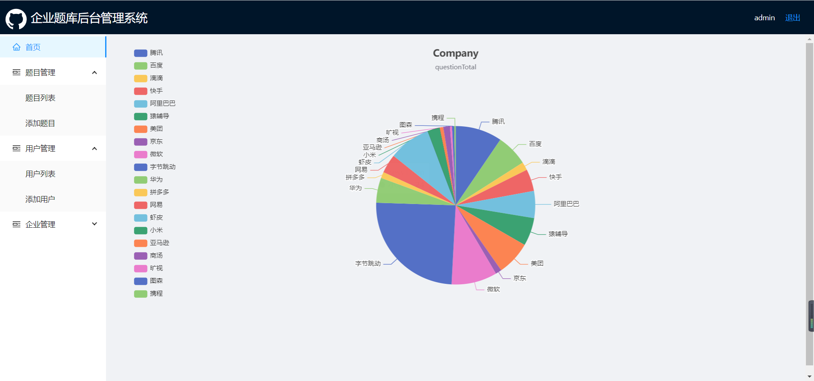
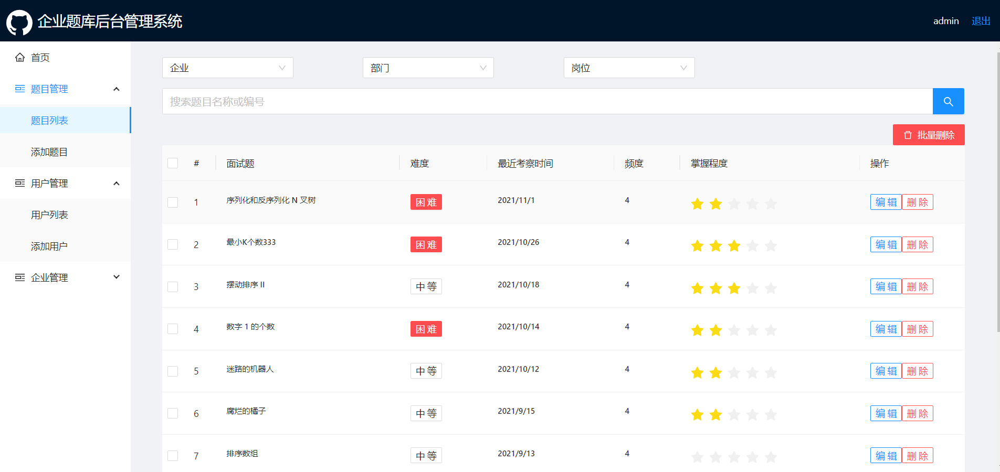
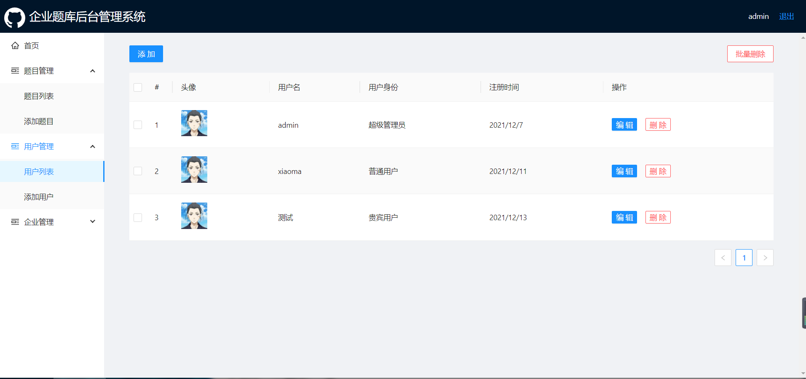
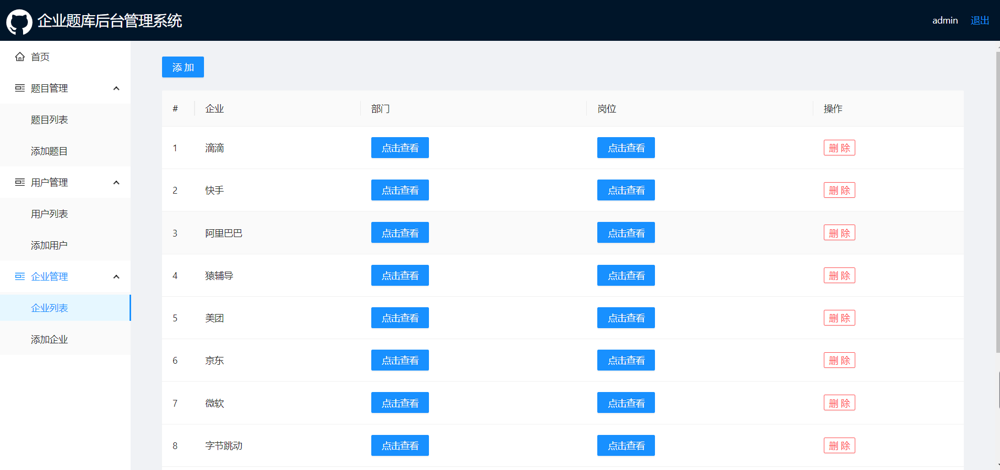

* 接口文档：https://easydoc.net/doc/27918382/V4becrMI/oTOk40ne

## 团队分工
* 负责人：xxx，团队成员：小马
* 负责模块说明
    * xxx
        1. 搭建目录
        2. 创建仓库
        3. 从官网拿数据
        4. 面试题列表CURD，三级导航，搜索
        5. 首页
    * 小马
        1. 从官网拿取数据
        2. 编写接口
        3. 用户管理模块
        4. 企业管理模块
## 项目截图
##### 首页

##### 题目列表

##### 用户列表

##### 企业列表

